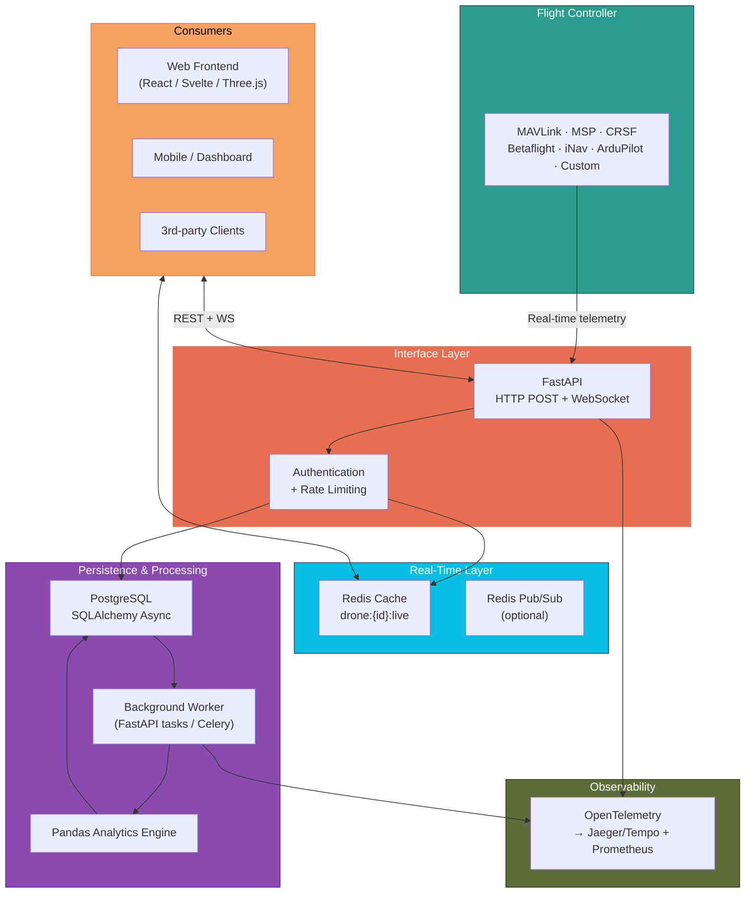

# Design

- [Design](#design)
  - [Data flow](#data-flow)
  - [High-Level Architecture](#high-level-architecture)
  - [Database Schema (PostgreSQL)](#database-schema-postgresql)
  - [Core Data Models (Pydantic v2 + SQLAlchemy 2.0)](#core-data-models-pydantic-v2--sqlalchemy-20)
  - [Detailed API Specification (OpenAPI-ready)](#detailed-api-specification-openapi-ready)


## Data flow

1. Data transmission: the robot streams telemetry packets at 50–200 Hz (position, velocity, attitude, throttle, battery voltage, current, mAh drawn, etc.).
2. Packets are collected by the interface layer. Every packet carries the drone’s `api_key` in the header:
   - it is opened a WebSocket to `/v1/telemetry/ws`, or
   - keeps POSTing small batches to `/v1/telemetry`
3. FastAPI receives the packets
   - Dependency injector validates the API key → resolves to a `drone_id`
   - Pydantic deserializes and validates the payload (timestamp must be monotonic, throttle 0–1.0, etc.).
   - If anything is wrong → immediate 400/401, packet is dropped.
4. Data persistance and live chache
   1. The exact same packet is written immediately to PostgreSQL `telemetry_raw` table with `flight_id = NULL` for now. This write is awaited (fire-and-forget would risk data loss on crash).
   2. Live cache (real-time dashboard): The packet is JSON-serialized and stored in Redis as drone: `{drone_id}:live` with EXPIRE 30 seconds. Optional: publish the packet on a Redis channel so any live frontend gets it instantly via Server-Sent Events or WebSocket push.
5. Flight session detection (background, runs every 5–10 seconds per drone): A lightweight async task looks at the recent throttle values of each active drone:
   - If throttle drops below 5 % and stays there for ≥10 seconds → the current flight is declared finished.
   - It creates a new row in the flights table (start_ts = first packet after previous idle, end_ts = now).
   - It bulk-updates all telemetry_raw rows belonging to that time window and sets flight_id to the new flight UUID.
6. Analytics computation triggers automatically: As soon as the flight row is closed (or manually via /recompute), a background job fires:
   - Loads the entire flight’s raw telemetry into a Pandas DataFrame in one query (thanks to the flight_id index).
   - Runs all the analytics in memory:
     - total mAh / Wh
     - power curve
     - voltage sag
     - throttle smoothness
     - roll/pitch/yaw std
     - efficiency Wh/km
     - pilot fingerprint metrics, etc.
   - Serializes everything into a big JSONB object and writes it once into flights.computed_metrics.
   - Updates a few denormalized columns (total_mah, min_voltage, duration_s, etc.) for fast leaderboards.
7. Consumers read the data
   - Live dashboard → reads Redis drone:{id}:live → <50 ms latency.
   - Historical flights → query /flights/{id} → PostgreSQL returns flight metadata + full computed_metrics JSON + (optionally) raw telemetry points for graphing.
   - Mobile app or web frontend → same REST endpoints.
8. Observability sees everything: Every single step above (ingestion → DB write → Redis write → sessionizer → pandas job) emits OpenTelemetry spans, so you can trace a single packet from the drone all the way to the final Wh/km number in Jaeger with exact latencies.


Result:
Zero telemetry is ever lost (persisted immediately), live view is buttery smooth (Redis), and deep analytics are available within seconds after landing — all with full tracing and monitoring from day one.


## High-Level Architecture



## Database Schema (PostgreSQL)

```sql
-- Devices
CREATE TABLE drones (
    id            UUID PRIMARY KEY DEFAULT gen_random_uuid(),
    name          TEXT NOT NULL,
    owner_id      UUID,                                   -- for future multi-user
    api_key       TEXT UNIQUE NOT NULL,
    created_at    TIMESTAMPTZ DEFAULT NOW(),
    updated_at    TIMESTAMPTZ DEFAULT NOW()
);

-- Raw telemetry (partitioned by time recommended for >10M rows)
CREATE TABLE telemetry_raw (
    id            BIGSERIAL,
    drone_id      UUID REFERENCES drones(id) ON DELETE CASCADE,
    ts            TIMESTAMPTZ NOT NULL,
    flight_id     UUID,                                   -- filled later by sessionizer
    position      POINT,                                  -- (x,y,z) or separate x,y,z DOUBLE PRECISION
    velocity      POINT,
    attitude      POINT,                                  -- roll, pitch, yaw in degrees
    throttle      SMALLINT,                               -- 0-1000 or 0.0-1.0
    voltage       DOUBLE PRECISION,
    current       DOUBLE PRECISION,
    mah_drawn     INTEGER,
    rssi          SMALLINT,
    extra         JSONB,                                  -- for future fields
    PRIMARY KEY (id, ts)
) PARTITION BY RANGE (ts);

-- Flights
CREATE TABLE flights (
    id             UUID PRIMARY KEY DEFAULT gen_random_uuid(),
    drone_id       UUID REFERENCES drones(id) ON DELETE CASCADE,
    start_ts       TIMESTAMPTZ NOT NULL,
    end_ts         TIMESTAMPTZ,
    duration_s     INTEGER,
    total_mah      INTEGER,
    max_current    DOUBLE PRECISION,
    min_voltage    DOUBLE PRECISION,
    bbox           BOX,                                    -- 3D bounding box
    computed_metrics JSONB,                                -- all pandas results here
    created_at     TIMESTAMPTZ DEFAULT NOW(),
    updated_at     TIMESTAMPTZ DEFAULT NOW()
);

CREATE INDEX idx_telemetry_raw_drone_ts ON telemetry_raw(drone_id, ts DESC);
CREATE INDEX idx_telemetry_raw_flight ON telemetry_raw(flight_id);
CREATE INDEX idx_flights_drone ON flights(drone_id);
CREATE INDEX idx_flights_start ON flights(start_ts DESC);
```


## Core Data Models (Pydantic v2 + SQLAlchemy 2.0)

```py
# models.py
from sqlalchemy import Column, String, DateTime, JSON, ForeignKey
from sqlalchemy.dialects.postgresql import UUID, POINT, BOX
from sqlalchemy.orm import DeclarativeBase, Mapped, mapped_column
from pydantic import BaseModel
from datetime import datetime
from typing import Optional
import uuid

class Base(DeclarativeBase):
    pass

class Drone(Base):
    __tablename__ = "drones"
    id: Mapped[uuid.UUID] = mapped_column(UUID(as_uuid=True), primary_key=True, default=uuid.uuid4)
    name: Mapped[str] = mapped_column(String, nullable=False)
    api_key: Mapped[str] = mapped_column(String, unique=True, index=True)

class TelemetryPacket(BaseModel):
    ts: datetime
    position: Optional[tuple[float, float, float]] = None
    velocity: Optional[tuple[float, float, float]] = None
    attitude: Optional[tuple[float, float, float]] = None
    throttle: float   # 0.0 – 1.0
    voltage: Optional[float]
    current: Optional[float]
    mah_drawn: Optional[int]
    rssi: Optional[int]
    extra: dict = {}

class TelemetryDB(Base):
    __tablename__ = "telemetry_raw"
    # ... fields matching above
```


## Detailed API Specification (OpenAPI-ready)

| Method | Endpoint                   | Auth        | Description                     | Request Body          | Response             |
| ------ | -------------------------- | ----------- | ------------------------------- | --------------------- | -------------------- |
| `POST` | /v1/telemetry              | API-Key     | Bulk ingest (up to 500 packets) | List[TelemetryPacket] | 201 + ingested count |
| `WS`   | /v1/telemetry/ws           | API-Key     | Real-time streaming             | binary/JSON packets   | live acknowledgments |
| `GET`  | /v1/drones                 | JWT         | List my drones                  | -                     | List[Drone]          |
| `POST` | /v1/drones                 | JWT         | Register new drone              | {name}                | Drone + api_key      |
| `GET`  | /v1/drones/{id}/live       | API-Key/JWT | Latest cached telemetry         | -                     | TelemetryPacket null |
| `GET`  | /v1/drones/{id}/flights    | JWT         | List flights (paginated)        | ?limit=50&offset=0    | List[FlightSummary]  |
| `GET`  | /v1/flights/{id}           | JWT         | Full flight + raw + analytics   | -                     | FlightDetail         |
| `POST` | /v1/flights/{id}/recompute | JWT         | Force recompute analytics       | -                     | 202 Accepted         |


